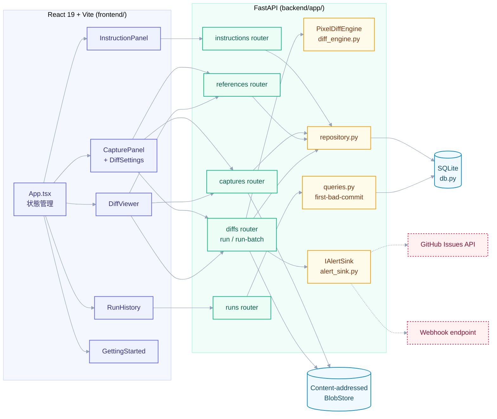
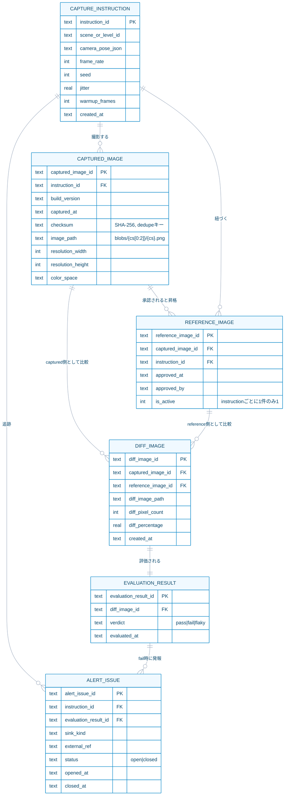
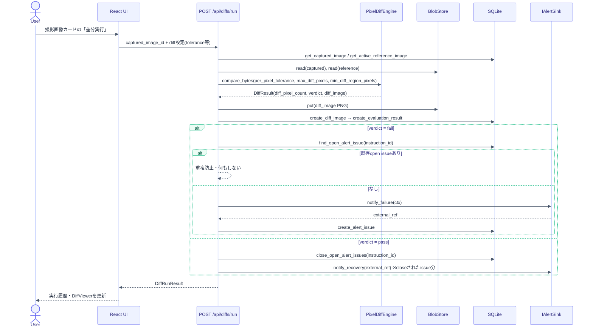
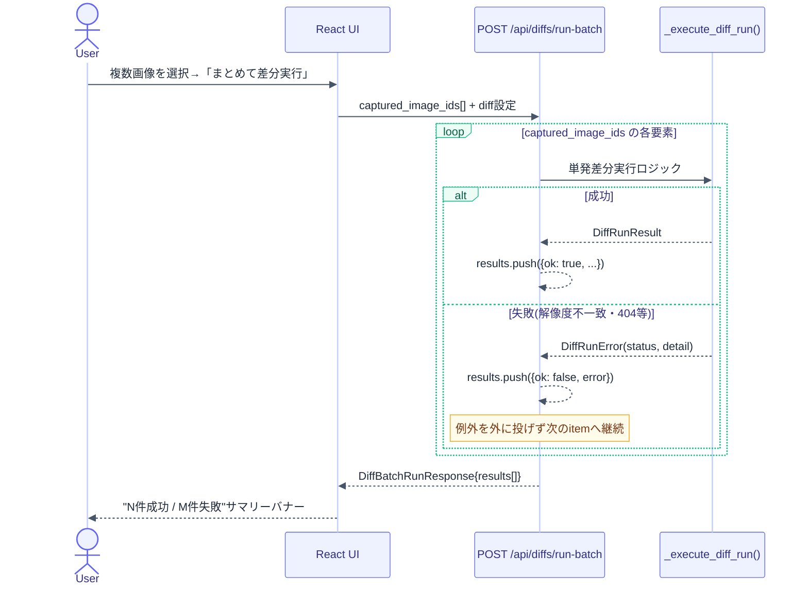
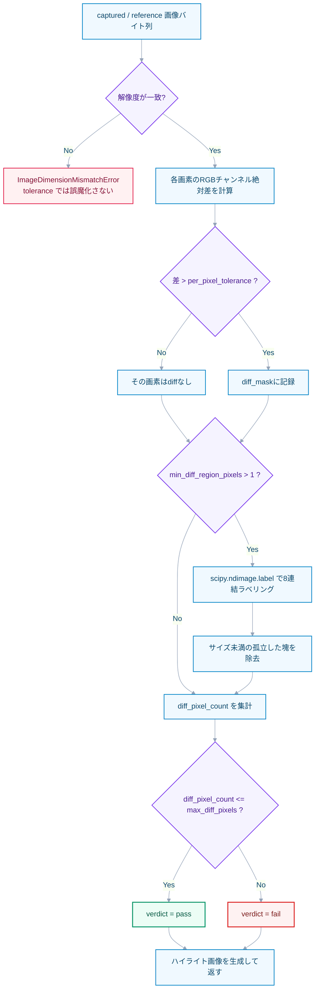
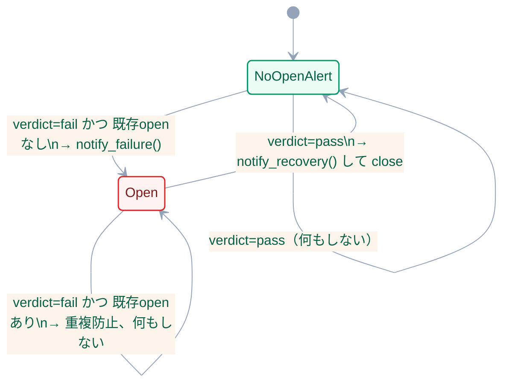
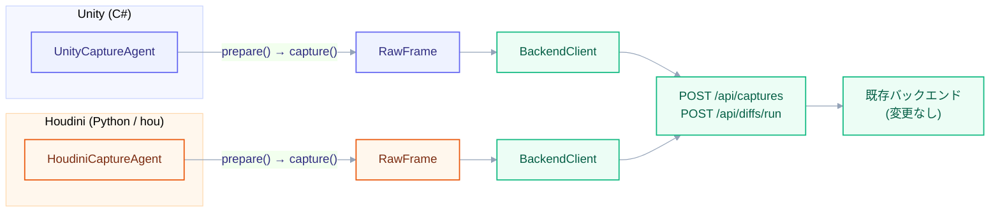

# アーキテクチャ図

[README.md](../README.md) / [TECHNICAL_GUIDE.md](TECHNICAL_GUIDE.md) と合わせて参照。GitHub上ではMermaidブロックがそのまま図として描画される。

配色は役割ごとに固定している: 🟦 フロントエンド(インディゴ) / 🟩 バックエンドAPI(エメラルド) / 🟧 コアロジック(アンバー) / 🔵 ストレージ(スカイ) / 🟥 外部連携(ローズ、破線)。

## 1. システム構成

## 2. データモデル(ER図)

Phase 4設計の「CaptureInstruction → CapturedImage → DiffImage → EvaluationResult」の一直線チェーンに、Phase 3の`ReferenceStore`昇格ワークフロー用テーブル(`REFERENCE_IMAGE`)とPhase 5のアラート追跡用テーブル(`ALERT_ISSUE`)を追加したもの。外部キーは全てNOT NULL(チェーンを曖昧にしない、というPhase 0のアンチパターン回避方針を反映)。

## 3. 単発差分実行のシーケンス

## 4. 一括(バッチ)差分実行のシーケンス

1件の失敗が他の項目の処理を止めないことが要点。`/run`と`/run-batch`は`_execute_diff_run()`という共通ロジックを共有し、`/run-batch`側だけが`_DiffRunError`を握りつぶして結果配列に積む。

## 5. PixelDiffEngineの判定フロー

SSIM等の知覚的差分は採用せず、あくまで「厳密なピクセル差分＋任意の後処理フィルタ」に留める(Phase 0 / Phase 3の設計方針)。`min_diff_region_pixels`による連結成分フィルタは類似度スコアではなく、あくまで「差分ピクセルが何個繋がっているか」という幾何的な後処理であることに注意。分岐(紫)・処理(青)・エラー/Fail(赤)・Pass(緑)で色分け。

## 6. アラートのライフサイクル(状態遷移)

`Research-Collector`の「失敗時ラベル付きIssue自動作成→復旧時自動クローズ」パターンを踏襲。openは赤(要対応)、no-open-alertは緑(健全)。

## 7. CaptureAgent共通インターフェース(Unity/Houdini連携)

詳細は [CAPTURE_AGENT_DESIGN.md](CAPTURE_AGENT_DESIGN.md)。サーバー側API(`/api/captures` `/api/diffs/run`)は変更せず、各エンジン側に立つ薄いエージェントが同じHTTP契約を満たすことで、既存のPhase 3-5パイプラインにそのまま乗る。Unity(インディゴ)・Houdini(オレンジ)・共通バックエンド(エメラルド)で色分け。

