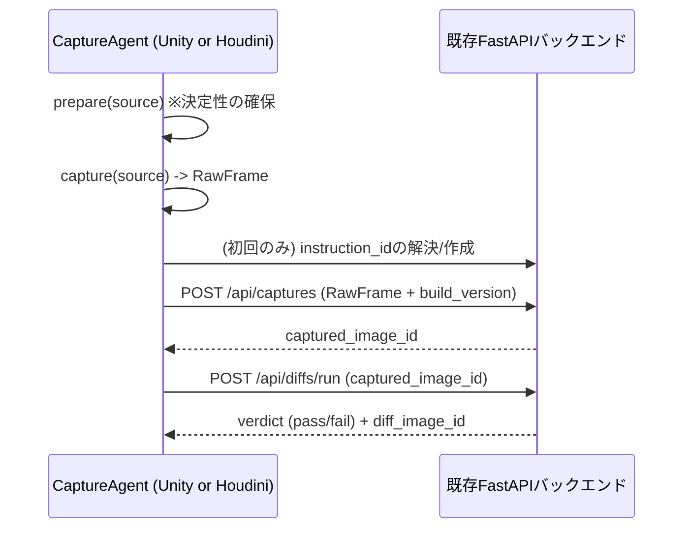

# CaptureAgent 共通インターフェース設計

Unity・Houdini(将来的には他のDCCツール)から、既存のFastAPIバックエンド(Phase 3-5)へ画像を送り込むための**エンジン非依存なクライアント側コントラクト**。サーバー側API(`/api/captures` `/api/diffs/run` `/api/diffs/run-batch`)は一切変更しない —— これらは元々PNGバイト列+メタデータを受け取るだけの汎用APIであり、送信元がUnityかHoudiniかを区別していない。「共通インターフェース」とは、各エンジン側に立つ薄いキャプチャエージェントが満たすべき契約のことを指す。

対応する実装:
- `capture_agents/` — Python版リファレンス実装(Houdiniは`hou`モジュールがPython前提のため、そのまま動作する)
- `unity_capture_agent/UnityCaptureAgent.cs` — Unity版リファレンス実装(C#、同じHTTP契約を満たす)

## 1. 設計方針

- Phase 1(再現性の確保)とPhase 2(撮影の実行)を、`prepare()` → `capture()` という2段階のライフサイクルとして抽象化する。「決定的にする」責務と「画素を取り出す」責務を分離することで、エンジンごとの決定性の作法(Unityのフレーム固定・シード固定、Houdiniのビューポート表示フラグ固定・クック完了待ち)を`prepare()`側に閉じ込め、`capture()`側はどのエンジンでも「画像バイト列を返すだけ」の薄い関数にする。
- **「view」と「comp」は同じ契約(`CaptureSource`)の`kind`フィールドで区別するだけで、輸送経路(HTTPアップロード)は完全に共通。** 各エンジンでの実際の取得手段が異なるだけ。
- サーバー側スキーマ変更はゼロ。エージェントは既存のCapturedImage/DiffImage/EvaluationResultのチェーンにそのまま乗る。

## 2. CaptureSource モデル

```python
@dataclass
class CaptureSource:
    kind: Literal["view", "comp"]
    source_id: str        # 例: "SceneView" / "/img/comp1/OUT" / "MainCamera"
    engine: Literal["unity", "houdini"]
    extra: dict[str, Any] = field(default_factory=dict)  # エンジン固有の追加情報
```

| `kind` | 意味 | Unityでの対応 | Houdiniでの対応 |
|---|---|---|---|
| `view` | インタラクティブなビューポート/ゲームビューの見た目 | `Camera.Render()`→`RenderTexture`、または`ScreenCapture.CaptureScreenshotAsTexture()`でバックバッファを取得 | `toolutils.sceneViewer().curViewport().saveImage(path)` |
| `comp` | コンポジット(合成)済みの最終出力 | Unityは多くの場合ポストプロセス込みの最終フレームが`view`と同一(下記注釈参照)。AOV合成等の別経路を持つ場合はそのレンダー結果を指す | 目的のCOPネットワークにぶら下がる**ROPノード**を指定し、それをレンダーさせてから出力ファイルを読む |

**注釈(Unityの`view`と`comp`について)**: Unityのレンダーパイプラインは基本的に単一のバックバッファへポストプロセス(TAA・Bloom・カラーグレーディング等)まで含めて描画するため、多くのプロジェクトでは`view`キャプチャの時点で既に「合成済み」の絵になる。複数レイヤー(AOV)を別々にレンダーしてから外部で合成するような特殊なパイプラインを組んでいる場合のみ、`comp`は別の取得経路(そのAOV合成結果の書き出し)を指す。この設計では両方を同じ`kind: "comp"`で表現できるようにしているが、単純なプロジェクトでは`view`のみで十分なケースが多い。

**注釈(Houdiniの`comp`について)**: COPネットワーク内のノードから直接ラスターを取り出すAPIは大きく変わりうるため、本設計ではより安定した方法を採る —— **「見たいCOPの出力を書き出すROPノードを、ユーザーが事前にHIPファイル内に用意しておき、エージェントはそのROPノードパスを`source_id`として受け取り、レンダーを走らせてから出力ファイルを読み込むだけ」**という方式にした。COP内部APIの差異を吸収でき、Houdiniユーザーにとっても「ROPで書き出す」は最も慣れた操作である。

## 3. RawFrame(キャプチャ結果)

```python
@dataclass
class RawFrame:
    data: bytes          # PNGエンコード済みバイト列
    width: int
    height: int
    color_space: str = "sRGB"
```

## 4. CaptureAgent インターフェース(Python版シグネチャ)

```python
class CaptureAgent(ABC):
    engine: ClassVar[str]

    @abstractmethod
    def prepare(self, source: CaptureSource) -> None:
        """撮影対象を決定的な状態に固定する(カメラ固定・表示フラグ固定・クック完了待ち等)。
        Phase 1 の DeterminismController / JitterOverride に相当する責務。"""

    @abstractmethod
    def capture(self, source: CaptureSource) -> RawFrame:
        """画素を取得してRawFrameとして返す。シーン状態を破壊的に変更しないこと。"""
```

C#版(Unity)も同じ2メソッドの契約を満たす(`IPrepare` / `ICapture`相当)。言語が違うだけで、HTTP経由でサーバーに渡すペイロードの形は完全に同一。

## 5. オーケストレーション(共通フロー)



`prepare()`→`capture()`より後ろは全て既存バックエンドのAPI呼び出しであり、Unity/Houdiniどちらのエージェントでも共通のクライアントコード(`BackendClient`)を使い回せる(Python版は`capture_agents/base.py`、C#版は`UnityCaptureAgent.cs`内に同等ロジックを実装)。

## 6. `instruction_id`の安定性についての注意(重要)

Phase 4のfirst-bad-commitクエリは「同一`instruction_id`に対する複数`build_version`の履歴」を前提にしている。エージェントが毎回`POST /api/instructions`で新規作成してしまうと、実行のたびに別系列の履歴になり、first-bad-commitクエリが機能しなくなる。

このため`BackendClient.ensure_instruction()`は次の優先順位で解決する:

1. **呼び出し側が`instruction_id`を明示的に渡した場合はそれを使う(推奨)。** CI等での継続実行では、instruction_idを設定ファイルや環境変数に保存しておき、明示的に渡すこと。
2. 渡されなかった場合、`GET /api/instructions`を取得し`scene_or_level_id`が一致する最初の1件を再利用する(簡易的な補助機能。同名のinstructionが複数存在する場合は最初の1件になる点に注意)。
3. 一致するものがなければ新規作成する。

サーバー側に`scene_or_level_id`のユニーク制約や「get or create」専用エンドポイントは追加していない(スコープ外)。将来的に運用上の曖昧さが問題になった場合は、`POST /api/instructions/ensure`のような冪等エンドポイントをサーバー側に追加することを検討する。

## 7. 決定性の責務分担(`prepare()`の中身)

| エンジン | `prepare()`でやること |
|---|---|
| Unity | `Time.captureFramerate`固定、`SeededRandomService`のシード注入、TAAジッター無効化(`HDAdditionalCameraData`経由)。Phase 1の設計をそのまま踏襲 |
| Houdini | 対象カメラ/ビューポートの`frame`を固定、`display flags`・シェーディングモードを固定、対象ネットワークが完全にクック済み(`hou.node(path).isTimeDependent()`等を見て未クックのdirty状態でないこと)を確認してからキャプチャする |

## 8. ディレクトリ構成

```
capture_agents/                 # Python版(Houdini向けリファレンス実装)
├── pyproject.toml
├── capture_agents/
│   ├── __init__.py
│   ├── models.py                # CaptureSource / RawFrame
│   ├── base.py                  # CaptureAgent ABC + BackendClient + run_capture_and_diff()
│   └── houdini_agent.py         # HoudiniCaptureAgent(hou依存、hython/Houdini内で実行)
└── tests/
    └── test_base.py             # BackendClientのオーケストレーションをhttpx.MockTransportで検証

unity_capture_agent/             # Unity版(C#、同じHTTP契約)
├── UnityCaptureAgent.cs
└── README.md
```

## 9. 今後の拡張候補

- 他のDCC(Nuke, Blender, Substance等)も同じ`CaptureSource`/`RawFrame`契約に乗せられる。追加のエージェント実装だけで済み、サーバー側変更は不要。
- `prepare()`が返す「決定性レポート」(実際に何を固定できたか)をDBに残せば、撮影が本当に決定的だったかを後から監査できる(現状は未実装、`CaptureInstruction`のメタデータ拡張が必要)。
- CIから常駐エージェントを呼び出すラッパー(GitHub Actionsステップ、あるいはローカルTask Scheduler)は、既存の`Research-Collector`のcronパターンを踏襲する形で別途用意する。
